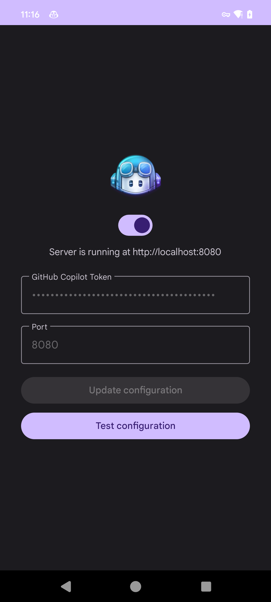
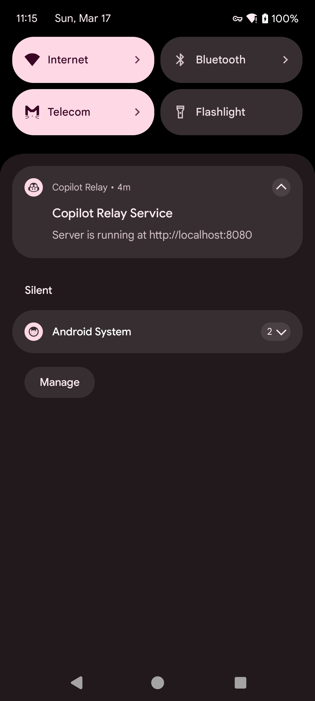

# Copilot Relay Android

[English](README.md) | [中文](README_zh.md)

Convert OpenAI format requests to GitHub Copilot API.

Currently supported APIs:

- `POST /v1/chat/completions`

Inspired by [copilot-gpt4-service](https://github.com/aaamoon/copilot-gpt4-service)

Screenshots:

  
  

# Usage

1. Obtain the Copilot API Token. You can refer to the Obtain Copilot API Token section in [copilot-gpt4-service](https://github.com/aaamoon/copilot-gpt4-service).
2. Open Copilot Relay, enter the Copilot API Token, and click switch button to start.
3. Open any chat App that supports the OpenAI API (self-tested BotGem/NextChat) and add the service http://localhost:8080, you can fill in any character for the API key.

> [!CAUTION]
> - This project is for learning and communication only, and may not be used for commercial purposes.
> - This project does not provide the Copilot API Token, you need to obtain it yourself.
> - Some systems need to set the power optimization whitelist, otherwise the service may be killed by the system.
