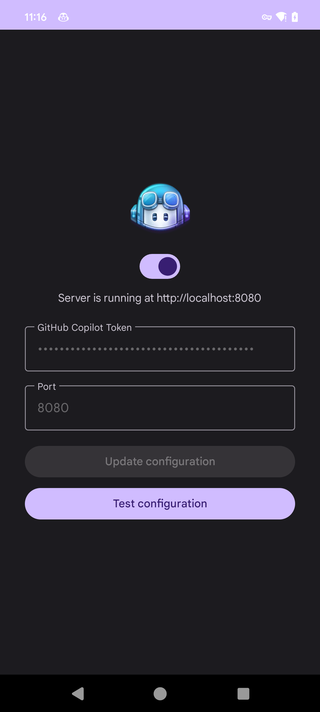

# Copilot Relay Android

[English](README.md) | [中文](README_zh.md)

将 OpenAI 格式请求转换为 GitHub Copilot API。

目前支持的 API：

- `POST /v1/chat/completions`

参考项目：[copilot-gpt4-service](https://github.com/aaamoon/copilot-gpt4-service)

截图：

  
  

# 使用方法

1. 获取 Copilot API 令牌。可以参考 [copilot-gpt4-service](https://github.com/aaamoon/copilot-gpt4-service) 中的获取 Copilot API 令牌部分。
2. 打开 Copilot Relay App，允许相关权限，输入 Copilot API 令牌，然后点击切换按钮开始。
3. 打开任何支持 OpenAI API 的聊天应用（自测过的：BotGem/NextChat）并添加服务 http://localhost:8080，API 密钥可以填写任何字符。

> [!CAUTION]
> - 此项目仅用于学习和交流，不得用于商业目的。
> - 此项目不提供 Copilot API Token，需要自行获取。
> - 某些系统需要设置电源优化白名单，否则服务可能会被系统杀死。
